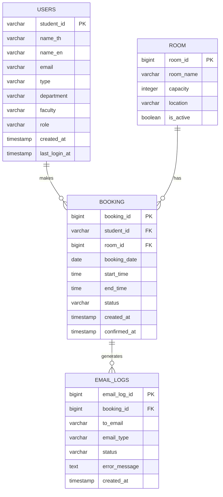

# Database ER Diagram

```mermaid
erDiagram

    USERS ||--o{ BOOKING : makes
    ROOM ||--o{ BOOKING : has
    BOOKING ||--o{ EMAIL_LOGS : generates

    USERS {
        varchar student_id PK
        varchar name_th
        varchar name_en
        varchar email
        varchar type
        varchar department
        varchar faculty
        varchar role
        timestamp created_at
        timestamp last_login_at
    }

    ROOM {
        bigint room_id PK
        varchar room_name
        integer capacity
        varchar location
        boolean is_active
    }

    BOOKING {
        bigint booking_id PK
        varchar student_id FK
        bigint room_id FK
        date booking_date
        time start_time
        time end_time
        varchar status
        timestamp created_at
        timestamp confirmed_at
    }

    EMAIL_LOGS {
        bigint email_log_id PK
        bigint booking_id FK
        varchar to_email
        varchar email_type
        varchar status
        text error_message
        timestamp created_at
    }
```