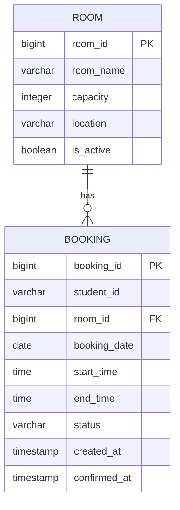

# Database ER Diagram

```mermaid
erDiagram

    ROOM ||--o{ BOOKING : has

    ROOM {
        bigint room_id PK
        varchar room_name
        integer capacity
        varchar location
        boolean is_active
    }

    BOOKING {
        bigint booking_id PK
        varchar student_id
        bigint room_id FK
        date booking_date
        time start_time
        time end_time
        varchar status
        timestamp created_at
        timestamp confirmed_at
    }
```